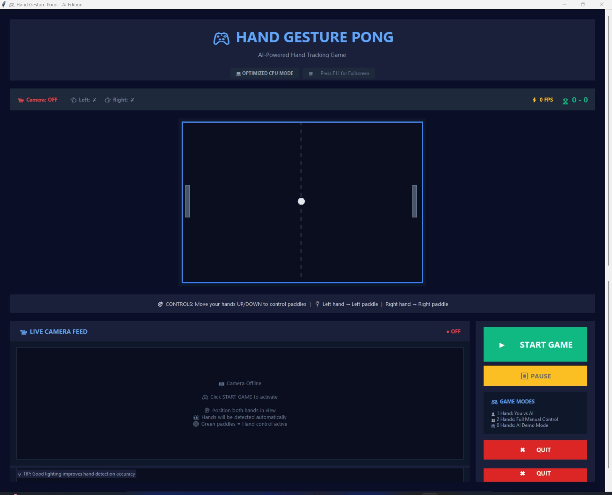

# 🏓 Hand Gesture Controlled Ping Pong Game

<div align="center">


**Play classic Pong using just your hands! No keyboard, no mouse, no controller needed.**

[Features](#-features) • [Installation](#-installation) • [How to Play](#-how-to-play) • [Controls](#-gesture-controls) • [Configuration](#-configuration) • [Troubleshooting](#-troubleshooting)

</div>

---

## 📋 Table of Contents

- [Overview](#-overview)
- [Features](#-features)
- [Demo](#-demo)
- [Prerequisites](#-prerequisites)
- [Installation](#-installation)
- [How to Play](#-how-to-play)
- [Gesture Controls](#-gesture-controls)
- [Configuration](#-configuration)
- [Project Structure](#-project-structure)
- [Technical Details](#-technical-details)
- [Troubleshooting](#-troubleshooting)
- [Contributing](#-contributing)
- [License](#-license)

---

## 🎯 Overview


This is an interactive **Ping Pong (Pong) game** that you control entirely with **hand gestures** using your webcam! Built with Python, OpenCV, and MediaPipe, this project demonstrates real-time computer vision and gesture recognition in an entertaining gaming experience.

The game features:
- ✋ **Hand tracking** for paddle control
- 👊 **Fist gestures** for game control (pause/resume)
- 👍👎 **Thumbs up/down** for ball speed adjustment
- 🤖 **AI opponent** when only one hand is detected
- 🎨 **Modern GUI** with real-time camera preview
- ⚡ **Optimized performance** for smooth gameplay on CPU

---

## ✨ Features

### 🎮 Gameplay Features
- **Dual Hand Control**: Control both paddles simultaneously or play against AI
- **Smart AI Opponent**: Adaptive AI with adjustable difficulty
- **Dynamic Ball Physics**: Realistic bouncing with angle-based paddle hits
- **Real-time Scoring**: Track your score with live updates
- **Pause/Resume**: Use fist gestures to control game flow

### 👋 Hand Gesture Recognition
- **Palm Detection**: Smooth paddle control with position smoothing
- **Fist Detection**: Advanced finger-curl detection for pause/resume
- **Thumbs Gestures**: Speed control with thumbs up/down
- **Gesture Cooldown**: Prevents accidental activations

### 🖥️ User Interface
- **Live Camera Preview**: See yourself and hand detection landmarks
- **Status Indicators**: Real-time hand detection and camera status
- **FPS Counter**: Monitor performance
- **Fullscreen Mode**: Immersive gaming experience (F11)
- **Debug Mode**: Detailed gesture detection logging (D key)

### ⚡ Performance Optimizations
- **CPU-Optimized**: Works efficiently without GPU
- **Frame Skipping**: Intelligent processing for better FPS
- **Exponential Smoothing**: Reduces hand jitter for stable control
- **Adaptive Camera Settings**: Configurable resolution and FPS

---

## 🎬 Demo

### Gameplay Modes

| Solo Mode (AI Opponent) | Two Player Mode |
|------------------------|-----------------|
| Show one hand to play against AI | Show both hands for two-player action |
| AI adapts to ball position | Each player controls their own paddle |

### Gesture Controls

| Gesture | Action | Visual |
|---------|--------|--------|
| **Open Palm** | Control paddle | ✋ |
| **Fist (Both Hands)** | Pause/Resume | 👊👊 |
| **Thumbs Up** | Increase ball speed | 👍 |
| **Thumbs Down** | Decrease ball speed | 👎 |

---

## 📦 Prerequisites

### System Requirements
- **Operating System**: Windows, Linux, or macOS
- **Python**: Version 3.11 or 3.12 (required)
- **Webcam**: Built-in or external camera
- **RAM**: Minimum 4GB recommended
- **Processor**: Multi-core CPU recommended for smooth gameplay

### Python Version Check
```bash
python --version
# or
py --version
```

If you don't have Python 3.11 or 3.12, download from [python.org](https://www.python.org/downloads/)

---

## 🚀 Installation

### Quick Start (Windows)

1. **Clone or Download** this repository:
   ```bash
   git clone https://github.com/yourusername/Hand-Gesture-Controlled-Ping-Pong-Game.git
   cd Hand-Gesture-Controlled-Ping-Pong-Game-main
   ```

2. **Run the Installer** (Windows):
   ```bash
   INSTALL.bat
   ```
   
   This will automatically:
   - Find compatible Python version (3.11 or 3.12)
   - Create a virtual environment
   - Install all dependencies
   - Launch the game

### Manual Installation (All Platforms)

1. **Clone the repository**:
   ```bash
   git clone https://github.com/yourusername/Hand-Gesture-Controlled-Ping-Pong-Game.git
   cd Hand-Gesture-Controlled-Ping-Pong-Game-main
   ```

2. **Create virtual environment**:
   ```bash
   # Windows
   python -m venv venv
   venv\Scripts\activate
   
   # Linux/Mac
   python3 -m venv venv
   source venv/bin/activate
   ```

3. **Install dependencies**:
   ```bash
   pip install -r requirements.txt
   ```

4. **Run the game**:
   ```bash
   python hand_refactored.py
   ```

### Alternative: Using Setup Script

```bash
python setup.py
```

The setup script will handle everything automatically!

---

## 🎮 How to Play

### Starting the Game

1. **Launch** the application using `INSTALL.bat` or `python hand_refactored.py`
2. **Position yourself** 2-3 feet from the camera with good lighting
3. **Click "Start Camera"** button or press the button in the UI
4. **Show your hand(s)** to the camera:
   - **Left hand** → Controls left paddle
   - **Right hand** → Controls right paddle
   - **One hand only** → Play against AI opponent

### Game Objectives

- **Defend your side**: Keep the ball from passing your paddle
- **Score points**: Make the ball pass your opponent's paddle
- **First to 10 wins** (configurable in `config.py`)

### Controls

| Action | Gesture |
|--------|---------|
| Move paddle up/down | Move hand up/down (open palm) |
| Pause game | Make fists with both hands |
| Resume game | Open both hands or make fists again |
| Increase ball speed | Thumbs up 👍 |
| Decrease ball speed | Thumbs down 👎 |
| Toggle fullscreen | Press F11 |
| Exit fullscreen | Press Escape |
| Debug mode | Press D |

---

## 🤚 Gesture Controls

### Hand Detection
- **Open Palm**: Default control mode - move your hand up/down to control paddle
- **Position**: Your hand's Y-position maps to paddle position
- **Smoothing**: Built-in smoothing prevents jittery movements

### Fist Detection (Pause/Resume)
- **Both Hands**: Make fists with BOTH hands simultaneously
- **Strict Detection**: All fingers must be curled to avoid false positives
- **Hold for 1 second**: Maintain gesture briefly for activation
- **Visual Feedback**: Status indicators show fist detection

### Thumbs Up/Down (Speed Control)
- **Thumbs Up** 👍: Increase ball speed (cooldown: 1 second)
- **Thumbs Down** 👎: Decrease ball speed (cooldown: 1 second)
- **Range**: Ball speed clamped between min/max values

### Debug Mode
Press **D** key to toggle debug logging:
- See finger extension ratios
- View finger curl detection
- Monitor gesture recognition details

---

## ⚙️ Configuration

All game settings can be customized in **`config.py`**:

### Game Settings
```python
CANVAS_WIDTH = 600          # Game canvas width
CANVAS_HEIGHT = 400         # Game canvas height
FRAME_SKIP = 2             # Process hands every N frames
```

### Camera Settings
```python
CAMERA_WIDTH = 320          # Camera resolution width
CAMERA_HEIGHT = 240         # Camera resolution height
CAMERA_FPS = 60            # Target FPS
```

### Hand Detection
```python
MAX_NUM_HANDS = 2                    # Maximum hands to track
MIN_DETECTION_CONFIDENCE = 0.5       # Detection threshold
MIN_TRACKING_CONFIDENCE = 0.5        # Tracking threshold
HAND_POSITION_SMOOTHING_FACTOR = 0.3 # Smoothing (0-1)
```

### Fist Detection
```python
FINGER_CLOSED_RATIO = 1.0      # Finger curl threshold
FIST_REQUIRED_FINGERS = 4      # Fingers needed for fist
FIST_HOLD_DURATION = 0.8       # Hold time (seconds)
```

### Ball Physics
```python
BALL_INITIAL_SPEED = 5.0       # Starting speed
BALL_MIN_SPEED = 3.0           # Minimum speed
BALL_MAX_SPEED = 12.0          # Maximum speed
BALL_RADIUS = 8                # Ball size
```

### Paddle Settings
```python
PADDLE_WIDTH = 10              # Paddle width
PADDLE_HEIGHT = 80             # Paddle height
PADDLE_SPEED = 8               # Movement speed
```

### AI Difficulty
```python
AI_DIFFICULTY = 0.85           # AI reaction chance (0-1)
AI_SPEED = 6                   # AI paddle speed
AI_ERROR_MARGIN = 15           # AI imperfection
```

---

## 📁 Project Structure

```
Hand-Gesture-Controlled-Ping-Pong-Game-main/
│
├── 📄 hand_refactored.py      # Main application entry point
├── 📄 config.py                # All configuration constants
├── 📄 hand_detector.py         # Hand tracking & gesture recognition
├── 📄 game_engine.py           # Game logic & physics
├── 📄 game_objects.py          # Ball and Paddle classes
├── 📄 ui_manager.py            # Tkinter GUI management
│
├── 📄 setup.py                 # Automatic setup script
├── 📄 INSTALL.bat              # Windows installer
├── 📄 requirements.txt         # Python dependencies
├── 📄 README.md                # This file
│
└── 📁 __pycache__/            # Python cache (auto-generated)
```

### Module Descriptions

| Module | Purpose |
|--------|---------|
| **hand_refactored.py** | Main game loop, coordinates all modules |
| **config.py** | Central configuration file for all settings |
| **hand_detector.py** | MediaPipe integration, gesture recognition |
| **game_engine.py** | Game logic, collision detection, scoring, AI |
| **game_objects.py** | Ball and Paddle classes with physics |
| **ui_manager.py** | Tkinter GUI, camera preview, status display |
| **setup.py** | Automated environment setup and dependency installation |

---

## 🔧 Technical Details

### Technologies Used

| Technology | Purpose | Version |
|------------|---------|---------|
| **Python** | Core language | 3.11/3.12 |
| **OpenCV** | Computer vision & camera handling | 4.8.1 |
| **MediaPipe** | Hand tracking & landmark detection | 0.10.14 |
| **Tkinter** | GUI framework | Built-in |
| **Pillow** | Image processing for GUI | 10.0.1 |
| **NumPy** | Numerical computations | ≥1.26.0 |

### Architecture

```
┌─────────────────────────────────────────┐
│         Main Application                │
│         (hand_refactored.py)            │
└──────────────┬──────────────────────────┘
               │
       ┌───────┴───────┐
       │               │
┌──────▼─────┐  ┌─────▼──────┐
│ UI Manager │  │Game Engine │
│  (Tkinter) │  │  (Logic)   │
└──────┬─────┘  └─────┬──────┘
       │               │
       │        ┌──────▼───────┐
       │        │ Game Objects │
       │        │ (Ball/Paddle)│
       │        └──────────────┘
       │
┌──────▼──────────┐
│  Hand Detector  │
│   (MediaPipe)   │
└─────────────────┘
```

### Performance Optimizations

1. **Frame Skipping**: Processes hand detection every N frames
2. **Exponential Smoothing**: Reduces jitter in hand positions
3. **Deadzone Filtering**: Ignores tiny movements
4. **Buffer Management**: Uses deques for efficient position history
5. **CPU-Only Mode**: Optimized for systems without GPU
6. **Reduced Camera Resolution**: Balances quality and performance

### Hand Detection Pipeline

```
Camera Frame → RGB Conversion → MediaPipe Hands → Landmark Detection
    ↓
Position Extraction → Smoothing → Normalization → Paddle Update
    ↓
Gesture Recognition → Fist/Thumbs Detection → Game Actions
```

---

## 🐛 Troubleshooting

### Common Issues

#### 1. **Camera not opening**
```
❌ Error: Camera Error - Could not open camera
```
**Solutions:**
- Ensure no other application is using the camera
- Check camera permissions in system settings
- Try different camera index in code (change `cv2.VideoCapture(0)` to `1`, `2`, etc.)
- Restart your computer

#### 2. **Python version incompatible**
```
❌ Error: No compatible Python version found
```
**Solutions:**
- Install Python 3.11 or 3.12 from [python.org](https://www.python.org/downloads/)
- Make sure to check "Add Python to PATH" during installation
- Restart terminal after installation

#### 3. **Hand detection not working**
**Solutions:**
- Ensure good lighting conditions
- Position yourself 2-3 feet from camera
- Show your full hand to camera (palm facing camera)
- Adjust `MIN_DETECTION_CONFIDENCE` in `config.py` (lower = easier detection)
- Press **D** to enable debug mode and check detection values

#### 4. **Fist detection not triggering**
**Solutions:**
- Make tight fists with ALL fingers curled
- Hold gesture for at least 1 second
- Use BOTH hands simultaneously
- Adjust `FIST_HOLD_DURATION` in `config.py` (lower = faster activation)
- Enable debug mode (D key) to see finger curl ratios

#### 5. **Paddle movement too jittery**
**Solutions:**
- Increase `HAND_POSITION_SMOOTHING_FACTOR` in `config.py` (higher = smoother)
- Increase `HAND_POSITION_BUFFER_SIZE` for more smoothing
- Adjust `HAND_POSITION_DEADZONE` to ignore tiny movements

#### 6. **Low FPS / Laggy performance**
**Solutions:**
- Increase `FRAME_SKIP` in `config.py` (process fewer frames)
- Reduce `CAMERA_WIDTH` and `CAMERA_HEIGHT`
- Set `MODEL_COMPLEXITY = 0` for fastest model
- Close other resource-intensive applications
- Reduce `MAX_NUM_HANDS` to `1` if playing solo

#### 7. **Dependencies installation fails**
**Solutions:**
- Update pip: `python -m pip install --upgrade pip`
- Install Visual C++ Build Tools (Windows): [Download here](https://visualstudio.microsoft.com/visual-cpp-build-tools/)
- Try installing packages individually:
  ```bash
  pip install opencv-python
  pip install mediapipe
  pip install pillow
  pip install numpy
  ```

### Debug Mode

Press **D** to enable debug mode for detailed logging:
```
🔍 DEBUG MODE ENABLED
You will now see detailed fist detection data in console:
• Finger extension ratios
• Which fingers are detected as closed
• Final fist detection result
```

### Performance Tips

- **Lighting**: Use good, even lighting for better detection
- **Background**: Plain background helps MediaPipe tracking
- **Distance**: Stay 2-3 feet from camera
- **Hand Position**: Keep hand fully visible in frame
- **Camera Quality**: Better camera = better tracking

---

## 🤝 Contributing

Contributions are welcome! Here's how you can help:

### Ways to Contribute

1. **Bug Reports**: Open an issue with details
2. **Feature Requests**: Suggest new features or improvements
3. **Code Contributions**: Submit pull requests
4. **Documentation**: Improve README or code comments
5. **Testing**: Test on different platforms and report results

### Development Setup

1. Fork the repository
2. Create a feature branch: `git checkout -b feature-name`
3. Make your changes
4. Test thoroughly
5. Commit: `git commit -m "Add feature-name"`
6. Push: `git push origin feature-name`
7. Create a Pull Request

### Code Style

- Follow PEP 8 guidelines
- Add docstrings to functions
- Comment complex logic
- Keep functions focused and modular

---

## 📝 License

This project is licensed under the **MIT License** - see below for details:

```
MIT License

Copyright (c) 2025 [Your Name]

Permission is hereby granted, free of charge, to any person obtaining a copy
of this software and associated documentation files (the "Software"), to deal
in the Software without restriction, including without limitation the rights
to use, copy, modify, merge, publish, distribute, sublicense, and/or sell
copies of the Software, and to permit persons to whom the Software is
furnished to do so, subject to the following conditions:

The above copyright notice and this permission notice shall be included in all
copies or substantial portions of the Software.

THE SOFTWARE IS PROVIDED "AS IS", WITHOUT WARRANTY OF ANY KIND, EXPRESS OR
IMPLIED, INCLUDING BUT NOT LIMITED TO THE WARRANTIES OF MERCHANTABILITY,
FITNESS FOR A PARTICULAR PURPOSE AND NONINFRINGEMENT. IN NO EVENT SHALL THE
AUTHORS OR COPYRIGHT HOLDERS BE LIABLE FOR ANY CLAIM, DAMAGES OR OTHER
LIABILITY, WHETHER IN AN ACTION OF CONTRACT, TORT OR OTHERWISE, ARISING FROM,
OUT OF OR IN CONNECTION WITH THE SOFTWARE OR THE USE OR OTHER DEALINGS IN THE
SOFTWARE.
```

---

## 🙏 Acknowledgments

- **MediaPipe** by Google for hand tracking technology
- **OpenCV** for computer vision capabilities
- **Python** community for excellent libraries
- All contributors and testers

---

## 📞 Support

Having issues? Need help?

- 📖 Check the [Troubleshooting](#-troubleshooting) section
- 🐛 Open an [Issue](https://github.com/yourusername/Hand-Gesture-Controlled-Ping-Pong-Game/issues)
- 💬 Join discussions in the [Discussions](https://github.com/yourusername/Hand-Gesture-Controlled-Ping-Pong-Game/discussions) tab
- 📧 Contact: your.email@example.com

---

## 🎓 Learning Resources

Want to learn more about the technologies used?

- **MediaPipe Hands**: [Official Documentation](https://google.github.io/mediapipe/solutions/hands.html)
- **OpenCV Python**: [Tutorials](https://docs.opencv.org/4.x/d6/d00/tutorial_py_root.html)
- **Tkinter GUI**: [Python Docs](https://docs.python.org/3/library/tkinter.html)
- **Computer Vision**: [PyImageSearch](https://pyimagesearch.com/)

---

## 🌟 Star History

If you found this project useful, please consider giving it a ⭐ on GitHub!

---

<div align="center">

**Made with ❤️ and Python**

[⬆ Back to Top](#-hand-gesture-controlled-ping-pong-game)

</div>
