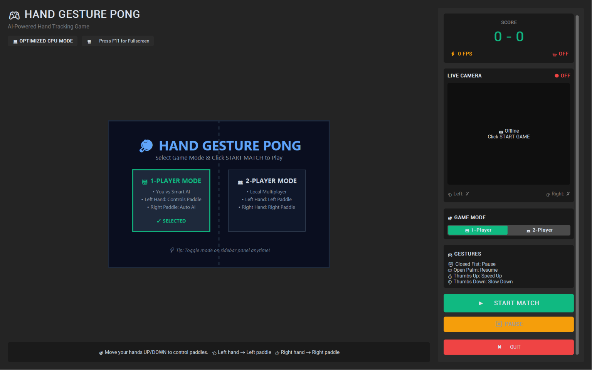

# 🏓 Hand Gesture Controlled Ping Pong Game

<div align="center">


**Play classic Pong using just your hands! No keyboard, no mouse, no controller needed.**

[Features](#-features) • [Installation](#-installation) • [How to Play](#-how-to-play) • [Controls](#-gesture-controls) • [Configuration](#-configuration) • [Troubleshooting](#-troubleshooting)

</div>

---

## 🎯 Overview


This is an interactive **Ping Pong (Pong) game** controlled entirely with **hand gestures** via your webcam! Built with Python, OpenCV, MediaPipe Tasks API, and CustomTkinter, this project demonstrates real-time multi-threaded computer vision and gesture recognition for a fluid, lag-free gaming experience.

The game features:
- ⚡ **Multi-Threaded Camera Pipeline**: OpenCV capture and MediaPipe gesture recognition run asynchronously on a background thread (`CameraThread`), keeping GUI and physics locked at a rock-solid 60 FPS.
- 🎯 **Main Menu & Game Modes**: Interactive canvas menu allowing mode switching between **🤖 1-Player (vs AI)** and **👥 2-Player (Local Multiplayer)**.
- ⏳ **3-Second Calibration & Countdown**: Pre-match countdown screen providing real-time hand detection feedback before the ball drops.
- ✋ **Hand Tracking & Interpolation**: Ultra-smooth exponential smoothing and target position interpolation to eliminate webcam movement jitter.
- ✊ **Fist Gestures**: Pause/resume match using double fist or open palm gestures.
- 👍👎 **Thumbs Speed Control**: Dynamically adjust ball velocity using Thumbs Up / Thumbs Down gestures.
- 🎨 **Modern Dark Mode GUI**: Built with CustomTkinter, featuring real-time camera previews, live FPS counters, and modal dialogs.

---

## ✨ Features

### 🎮 Gameplay Features
- **Main Menu**: Interactive canvas menu for selecting game modes before starting a match.
- **Game Modes**:
  - 🤖 **1-Player Mode**: Play against an adaptive AI opponent using your left hand.
  - 👥 **2-Player Mode**: Local 2-player action where both left and right hands control the paddles.
- **3-Second Calibration & Countdown**: 3... 2... 1... GO! countdown overlay validating hand tracking status before match start.
- **Dynamic Ball Physics**: Realistic bouncing, hit position angle calculations, and speed scaling on paddle hits.
- **Real-time Scoring & FPS Metrics**: Live score tracking and performance monitoring.
- **Gesture Control Flow**: Pause/Resume game with double fists or open palms.

### 👋 Hand Gesture Recognition
- **Position Tracking**: Middle finger landmark tracking mapped directly to paddle coordinates.
- **Fist Detection**: Gesture recognition using MediaPipe's Tasks API for pause/resume triggering.
- **Thumbs Gestures**: Speed up (Thumbs Up 👍) or slow down (Thumbs Down 👎) the ball in real time.
- **Gesture Cooldown**: Built-in 1.0s cooldown to prevent gesture spamming.

### 🖥️ User Interface & Polish
- **Side-by-Side Dashboard Layout**: Dedicated game pitch canvas on the left, live camera preview and controls dashboard on the right.
- **Live Camera Preview**: Real-time webcam feed with colored hand skeleton landmarks.
- **Status Badges**: Visual indicator icons for camera feed and hand tracking state (`Left: ✓`, `Right: ✓`).
- **Fullscreen Support**: Toggle fullscreen with **F11**, exit with **Escape**.
- **Debug Mode**: Toggle console gesture logging by pressing **D**.

### ⚡ Technical & Threading Architecture
- **Asynchronous Worker Thread (`CameraThread`)**: Moves camera frame acquisition (`cv2.VideoCapture`) and ML model inference (`GestureRecognizer`) off the main thread.
- **Frame ID Synchronization**: The main loop safe-fetches new frames via thread locks without blocking the GUI or game physics.
- **Position Interpolation (`update_smooth`)**: Interpolates 30 FPS camera coordinates to 60 FPS physics updates for buttery-smooth paddle motion.

---

## 🎬 Gameplay Modes & Controls

### Gameplay Modes

| Mode | Description | Controls |
|------|-------------|----------|
| 🤖 **1-Player Mode (vs AI)** | Play solo against a smart adaptive AI opponent | Left Hand controls Left Paddle, Right Paddle is AI |
| 👥 **2-Player Mode (Local)** | Local multiplayer for 2 players in front of camera | Left Hand = Left Paddle, Right Hand = Right Paddle |

### Gesture Controls Summary

| Gesture | Action | Visual |
|---------|--------|--------|
| **Open Palm** | Control paddle up/down | ✋ |
| **Fist (Both Hands)** | Pause game | ✊✊ |
| **Open Palms (Both Hands)** | Resume game | 👐👐 |
| **Thumbs Up** | Increase ball speed | 👍 |
| **Thumbs Down** | Decrease ball speed | 👎 |

---

## 📦 Prerequisites

### System Requirements
- **Operating System**: Windows 10/11, Linux, or macOS
- **Python**: Version 3.11 or 3.12 (recommended)
- **Webcam**: Built-in laptop webcam or USB camera
- **RAM**: Minimum 4GB (8GB recommended)
- **Processor**: Multi-core CPU for multi-threaded performance

---

## 🚀 Installation

### Quick Start (Windows)

1. **Clone or Download** this repository:
   ```bash
   git clone https://github.com/saksham-dev07/Hand-Gesture-Controlled-Ping-Pong-Game.git
   cd Hand-Gesture-Controlled-Ping-Pong-Game-main
   ```

2. **Run Automatic Setup**:
   ```bash
   INSTALL.bat
   ```
   *This automatically sets up a working virtual environment, installs dependencies, downloads MediaPipe models if missing, and launches the app!*

### Manual Installation (All Platforms)

1. **Clone the repository**:
   ```bash
   git clone https://github.com/saksham-dev07/Hand-Gesture-Controlled-Ping-Pong-Game.git
   cd Hand-Gesture-Controlled-Ping-Pong-Game-main
   ```

2. **Create virtual environment**:
   ```bash
   # Windows
   python -m venv venv
   venv\Scripts\activate

   # Linux/macOS
   python3 -m venv venv
   source venv/bin/activate
   ```

3. **Install dependencies**:
   ```bash
   pip install -r requirements.txt
   ```

4. **Run the game**:
   ```bash
   python src/main.py
   ```

---

## 🎮 How to Play

1. **Launch App**: Open the game via `INSTALL.bat` or `python src/main.py`.
2. **Main Menu**: Choose your mode on the sidebar panel (**🤖 1-Player** or **👥 2-Player**).
3. **Start Match**: Click **▶️ START MATCH**.
4. **Calibration Phase**: A 3-second countdown will start while verifying your hand tracking status (`Left Hand: TRACKED ✓`).
5. **Game On**:
   - Move your hand **UP/DOWN** to move your paddle.
   - Close **BOTH FISTS** to pause the game.
   - Open **BOTH PALMS** to resume.
   - Show **THUMBS UP** to boost ball speed or **THUMBS DOWN** to slow it down.
6. **Return to Menu**: Click **⏹️ STOP MATCH** at any time to return to the Main Menu.

---

## ⚙️ Configuration

All settings can be customized in **`src/config.py`**:

```python
# Game & Canvas Dimensions
CANVAS_WIDTH = 720          # Pitch width in pixels
CANVAS_HEIGHT = 480         # Pitch height in pixels

# Camera Settings
CAMERA_WIDTH = 640          # Camera capture width
CAMERA_HEIGHT = 480         # Camera capture height
CAMERA_FPS = 60            # Target camera FPS

# Hand Detection & Thresholds
HAND_CONFIDENCE_THRESHOLD = 0.5       # MediaPipe confidence cutoff
HAND_POSITION_SMOOTHING_FACTOR = 0.3 # Exponential moving average factor
HAND_POSITION_DEADZONE = 0.0          # Movement deadzone

# Ball Physics
BALL_INITIAL_SPEED = 5.0    # Initial velocity magnitude
BALL_MAX_SPEED = 18.0       # Max speed cap
BALL_MIN_SPEED = 3.0        # Min speed floor

# Calibration & Countdown
CALIBRATION_COUNTDOWN_SECONDS = 3     # Pre-match countdown duration
```

---

## 📁 Project Structure

```
Hand-Gesture-Controlled-Ping-Pong-Game-main/
│
├── 📁 src/                     # Source code directory
│   ├── 📄 main.py              # Main app entry point & state orchestrator
│   ├── 📄 config.py            # Configuration settings & constants
│   ├── 📄 camera_thread.py     # Background worker thread for camera & MediaPipe
│   ├── 📄 hand_detector.py     # MediaPipe Tasks API integration & landmark drawing
│   ├── 📄 game_engine.py       # Game logic, physics, mode handling & AI
│   ├── 📄 game_objects.py      # Ball and Paddle physics objects
│   └── 📄 ui_manager.py        # CustomTkinter GUI & canvas rendering
│
├── 📁 assets/                  # Game assets & MediaPipe models
│   ├── 📄 gesture_recognizer.task # MediaPipe gesture model
│   └── 📄 demo.jpg             # Demonstration screenshot
│
├── 📄 INSTALL.bat              # Windows one-click installer script
├── 📄 setup.py                 # Automated setup & model downloader
├── 📄 requirements.txt         # Dependencies (opencv, mediapipe, customtkinter, etc.)
└── 📄 README.md                # Project documentation
```

### Module Architecture

| Module | Responsibilities |
|--------|------------------|
| **`src/main.py`** | Main loop, state machine (`MENU`, `CALIBRATING`, `PLAYING`), countdown timer, input bindings |
| **`src/camera_thread.py`** | Asynchronous daemon thread for OpenCV capture and MediaPipe processing |
| **`src/hand_detector.py`** | MediaPipe Tasks API integration, gesture recognition, landmark drawing |
| **`src/game_engine.py`** | Game state, ball movement, collision detection, scoring, AI behavior |
| **`src/game_objects.py`** | Ball and Paddle entities with target position smoothing (`update_smooth`) |
| **`src/ui_manager.py`** | CustomTkinter GUI layout, Main Menu rendering, Calibration overlay, side dashboard |
| **`src/config.py`** | Central configuration for dimensions, thresholds, colors, and constants |

---

## 🐛 Troubleshooting

#### 1. **Camera Not Opening**
- Ensure no other application (Zoom, Teams, Skype) is using your webcam.
- Check camera privacy permissions in system settings.

#### 2. **Jittery Paddle Movement**
- We use position smoothing (`HAND_POSITION_SMOOTHING_FACTOR = 0.3`) and paddle interpolation (`update_smooth()`).
- Ensure adequate room lighting so the webcam maintains a consistent exposure rate.

#### 3. **Hand Lines Flickering**
- Verify that `FRAME_SKIP = 1` and `HAND_LANDMARK_DRAW_FREQ = 1` in `src/config.py`.

---

## 📝 License

This project is licensed under the **MIT License** - see the [LICENSE](LICENSE) file for details.

---

## 🙏 Acknowledgments

- **MediaPipe** by Google for real-time vision & gesture tracking APIs.
- **OpenCV** for camera feed processing.
- **CustomTkinter** for modern dark mode UI widgets.
