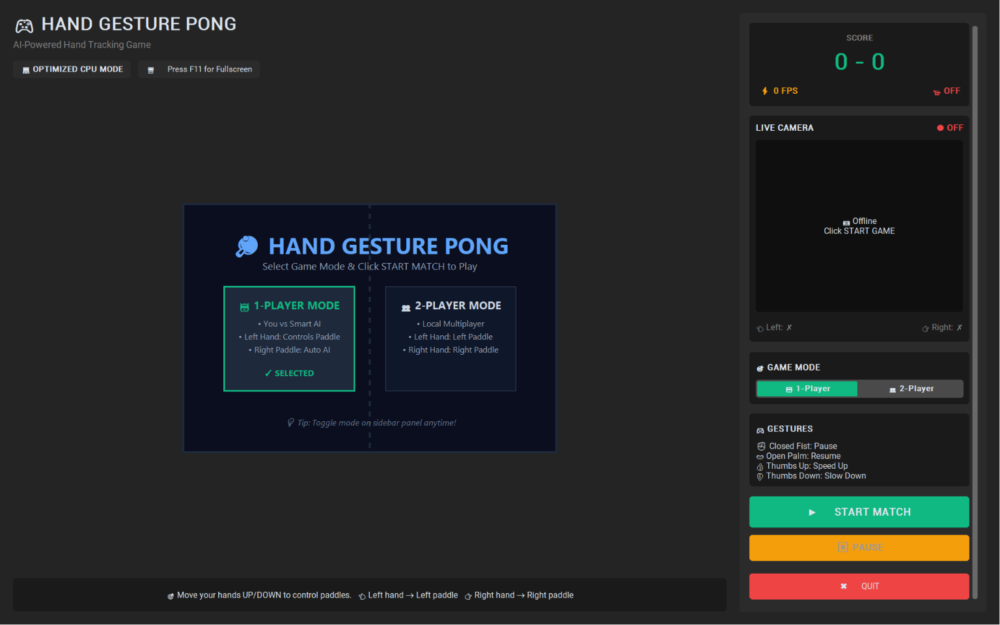
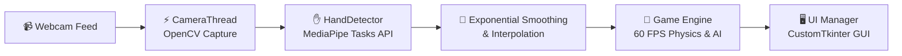

# 🏓 Hand Gesture Controlled Ping Pong Game

<div align="center">

[](https://www.python.org/)
[](https://opencv.org/)
[](https://ai.google.dev/edge/mediapipe/solutions/guide)
[](https://github.com/TomSchimansky/CustomTkinter)
[](https://numpy.org/)
[](LICENSE)
[](https://github.com/saksham-dev07/Hand-Gesture-Controlled-Ping-Pong-Game)

**Play classic Ping Pong using real-time webcam hand gestures — no keyboard, mouse, or controller required !**



[What It Does](#-what-the-project-does) • [Why It Is Useful](#-why-it-is-useful) • [Getting Started](#-getting-started) • [Controls & Shortcuts](#-controls--shortcuts) • [Architecture & Codebase](#-architecture--codebase) • [Where to Get Help](#-where-to-get-help) • [Contributing](#-maintainers--contributing)

</div>

---

## 📌 What the Project Does

The **Hand Gesture Controlled Ping Pong Game** is an interactive computer vision desktop application that translates physical hand movements captured by a standard webcam into real-time paddle movement and game controls.

### Technical Architecture


```mermaid
flowchart LR
    A[📹 Webcam Feed] --> B[⚡ CameraThread<br/>OpenCV Capture]
    B --> C[✋ HandDetector<br/>MediaPipe Tasks API]
    C --> D[🎯 Exponential Smoothing<br/>& Interpolation]
    D --> E[🏓 Game Engine<br/>60 FPS Physics & AI]
    E --> F[🖥️ UI Manager<br/>CustomTkinter GUI]
```

- **Asynchronous Worker Thread (`CameraThread`)**: Camera frame capture and MediaPipe ML gesture inference run off the main thread, keeping physics updates and GUI rendering locked at a smooth **60 FPS**.
- **Real-Time Landmark Tracking**: Maps hand position (middle finger MCP joint) to paddle Y-coordinates using exponential moving average smoothing to eliminate movement jitter.
- **Dynamic Gesture Recognition**: Recognizes fist and thumbs gestures using MediaPipe's Tasks API to trigger pause, resume, and speed boost actions.

---

## ✨ Why It Is Useful

- **Zero Special Hardware**: Runs on any standard webcam — no controllers, sensors, or specialized hardware required.
- **High-FPS Multi-Threaded Engine**: Asynchronous vision pipeline ensures zero main-thread lag or frame drops during gameplay.
- **Multiple Game Modes**:
  - 🤖 **1-Player Mode (vs AI)**: Compete against an adaptive AI opponent using your left hand.
  - 👥 **2-Player Mode (Local)**: Local head-to-head multiplayer where two players control paddles simultaneously.
- **Pre-Match 3-Second Calibration**: Integrated countdown screen that validates hand tracking before launching the ball.
- **Dynamic Physics & Angle Deflection**: Ball deflection angles depend on where the ball hits the paddle, rewarding skilled placement.
- **Extensible Architecture**: Decoupled module design in [`src/`](src/) ideal for computer vision research, custom ML models, or arcade game development.

> [!TIP]
> **Optimal Tracking Environment**: For best gesture tracking performance, operate in a well-lit room with your hands clearly visible to the camera. Avoid direct strong light sources behind your back.

---

## 🚀 Getting Started

### Prerequisites

- **Python**: Version 3.11, 3.12, or 3.13
- **Webcam**: Built-in laptop camera or external USB webcam
- **Operating System**: Windows 10/11, macOS, or Linux

### Installation

#### Automated Quick Start (Windows)
Clone the repository and run the one-click launcher:
```bash
git clone https://github.com/saksham-dev07/Hand-Gesture-Controlled-Ping-Pong-Game.git
cd Hand-Gesture-Controlled-Ping-Pong-Game
INSTALL.bat
```

> [!NOTE]
> `INSTALL.bat` automatically sets up the Python virtual environment, installs required packages, downloads the missing MediaPipe `gesture_recognizer.task` model to `assets/`, and launches the application.

#### Manual Installation (Cross-Platform)

1. **Clone the repository**:
   ```bash
   git clone https://github.com/saksham-dev07/Hand-Gesture-Controlled-Ping-Pong-Game.git
   cd Hand-Gesture-Controlled-Ping-Pong-Game
   ```

2. **Create and activate a virtual environment**:
   - **Windows**:
     ```bash
     python -m venv venv
     venv\Scripts\activate
     ```
   - **macOS / Linux**:
     ```bash
     python3 -m venv venv
     source venv/bin/activate
     ```

3. **Install dependencies**:
   ```bash
   pip install -r requirements.txt
   ```

4. **Verify setup & download model assets**:
   ```bash
   python setup.py
   ```

---

## 🎮 Controls & Shortcuts

### Gesture Controls

| Gesture | Action | Description | Visual |
| :--- | :--- | :--- | :---: |
| **Open Palm** | Move Paddle | Move hand vertically up/down to adjust paddle position | ✋ |
| **Both Fists** | Pause Match | Close both hands into fists to pause the active match | ✊✊ |
| **Both Open Palms** | Resume Match | Open both hands into palms to resume match | 👐👐 |
| **Thumbs Up** | Boost Speed | Show Thumbs Up gesture to increase ball velocity | 👍 |
| **Thumbs Down** | Lower Speed | Show Thumbs Down gesture to decrease ball velocity | 👎 |

### Keyboard Shortcuts

| Key | Function |
| :--- | :--- |
| **F11** | Toggle Fullscreen Mode |
| **Escape** | Exit Fullscreen Mode |
| **D** / **d** | Toggle Debug Overlay & Console Gesture Logs |

---

## 💻 Usage & Code Snippets

### Launching the Game
```bash
python src/main.py
```

### Customizing Configuration Parameters
Adjust court dimensions, gesture confidence cutoffs, and physics constants in [`src/config.py`](src/config.py):

```python
# Custom configuration snippet in src/config.py

# Pitch & Canvas Dimensions
CANVAS_WIDTH = 720
CANVAS_HEIGHT = 480

# Camera & Hand Tracking Thresholds
HAND_CONFIDENCE_THRESHOLD = 0.5        # Cutoff confidence score for MediaPipe
HAND_POSITION_SMOOTHING_FACTOR = 0.3  # Exponential moving average factor (lower = smoother)

# Ball Physics Limits
BALL_INITIAL_SPEED = 5.0
BALL_MAX_SPEED = 18.0
```

### Programmatic Component Instantiation
Integrate core modules into custom computer vision scripts:

```python
from src.camera_thread import CameraThread
from src.game_engine import GameEngine

# Initialize background vision worker thread
camera_thread = CameraThread()
camera_thread.start()

# Initialize game engine & select game mode
engine = GameEngine()
engine.set_game_mode("1PLAYER")  # Supported modes: "1PLAYER", "2PLAYER"
```

> [!IMPORTANT]
> The vision worker thread runs asynchronously (`daemon=True`). Always access shared frame data using thread-safe accessors in `CameraThread` to prevent UI thread lockups.

---

## 🏗️ Architecture & Codebase

```
Hand-Gesture-Controlled-Ping-Pong-Game/
├── 📁 src/
│   ├── 📄 main.py           # Application entry point & state machine orchestrator
│   ├── 📄 config.py         # Global configuration constants and parameters
│   ├── 📄 camera_thread.py  # Background worker thread for camera capture & MediaPipe
│   ├── 📄 hand_detector.py # MediaPipe Tasks API integration & landmark visualization
│   ├── 📄 game_engine.py   # Core physics engine, collision math, & AI logic
│   ├── 📄 game_objects.py  # Ball and Paddle entities with target smoothing
│   └── 📄 ui_manager.py    # CustomTkinter GUI layout & canvas rendering
├── 📁 assets/               # Gesture recognizer models, icons, and preview media
├── 📄 INSTALL.bat          # Automated Windows installer & launcher
├── 📄 setup.py             # Setup script & MediaPipe model downloader
├── 📄 requirements.txt     # Python dependency manifest
├── 📄 CONTRIBUTING.md      # Developer contribution guidelines
├── 📄 LICENSE              # MIT License details
└── 📄 README.md            # Main project documentation
```

### Module Responsibilities

| Module | Core Responsibility |
| :--- | :--- |
| [`src/main.py`](src/main.py) | Game loop orchestrator, state machine (`MENU`, `CALIBRATING`, `PLAYING`), timer & shortcut bindings |
| [`src/camera_thread.py`](src/camera_thread.py) | Asynchronous daemon thread handling OpenCV video capture and MediaPipe gesture detection |
| [`src/hand_detector.py`](src/hand_detector.py) | MediaPipe Tasks API gesture classification and skeleton landmark visualization |
| [`src/game_engine.py`](src/game_engine.py) | Ball physics, paddle reflection math, scoring logic, and adaptive AI opponent behavior |
| [`src/game_objects.py`](src/game_objects.py) | Ball and Paddle object models featuring smooth target position interpolation (`update_smooth`) |
| [`src/ui_manager.py`](src/ui_manager.py) | CustomTkinter dark mode GUI layout, live camera preview panel, and interactive main menu |
| [`src/config.py`](src/config.py) | Centralized constants for canvas dimensions, colors, thresholds, and initial speeds |

---

## 💬 Where to Get Help

- **Issue Tracker**: Report bugs or request feature enhancements via [GitHub Issues](https://github.com/saksham-dev07/Hand-Gesture-Controlled-Ping-Pong-Game/issues).
- **Community Discussions**: Share feedback and discuss feature ideas on [GitHub Discussions](https://github.com/saksham-dev07/Hand-Gesture-Controlled-Ping-Pong-Game/discussions).
- **Source Documentation**: Inspect source code implementation details directly in [`src/`](src/).

---

## 👥 Maintainers & Contributing

### Maintainer

- **Saksham** ([@saksham-dev07](https://github.com/saksham-dev07)) — Lead Developer & Project Maintainer

### Contributing

Contributions are warmly welcomed! To contribute:

1. Fork the repository.
2. Create a feature branch (`git checkout -b feature/amazing-feature`).
3. Commit your changes (`git commit -m 'Add amazing feature'`).
4. Push to your branch (`git push origin feature/amazing-feature`).
5. Open a Pull Request.

Please read [CONTRIBUTING.md](CONTRIBUTING.md) for details on code formatting, testing standards, and pull request guidelines.

---

## 📜 License

Distributed under the MIT License. See [LICENSE](LICENSE) for more information.
